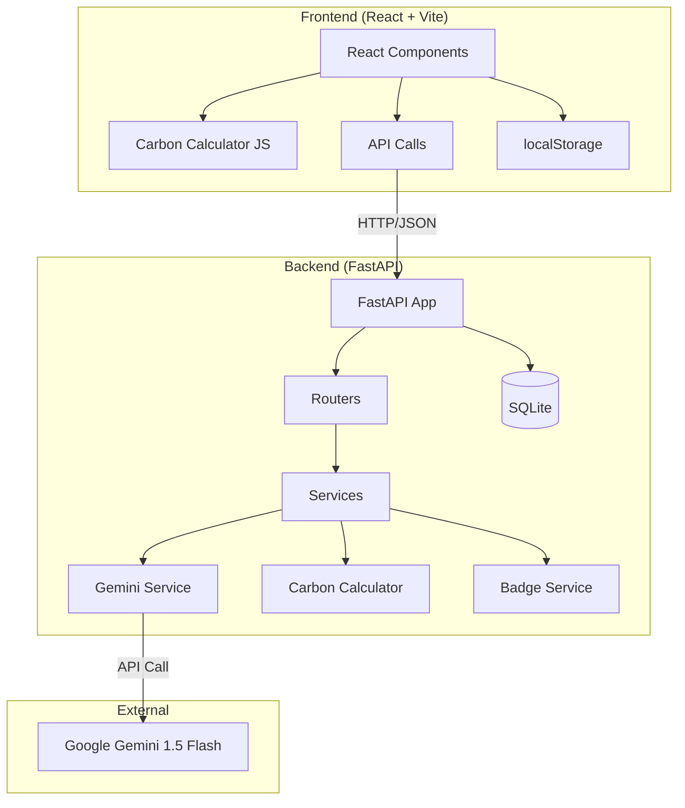

# 🌿 HaraBharat (हरा भारत) — Carbon Footprint Awareness Platform

> **Apni dharti bachao — ek kadam ek din!**
>
> HaraBharat ek AI-powered carbon footprint tracker hai jo individuals ko help karta hai apna carbon footprint samajhne, track karne, aur reduce karne mein — through simple daily actions aur personalized Hinglish insights.

---

## 🎯 Problem Statement

Design a solution that helps individuals understand, track, and reduce their carbon footprint through simple actions and personalized insights.

## ✨ Key Features

| Feature | Description |
|---------|-------------|
| 📊 **Daily Carbon Log** | 4 categories mein carbon track karo — Transport, Khana, Bijli, Kachra |
| 🎯 **AI Dashboard** | Circular gauge, 30-day trends, category breakdown charts |
| 🤖 **Eco Mitra Chatbot** | Gemini-powered AI assistant — Hinglish mein sustainability tips |
| 🏅 **Badges & XP** | Gamification — 6 badges earn karo, XP kamao! |
| 🎯 **Daily Challenges** | 3 AI-generated eco challenges daily |
| 📝 **Weekly AI Report** | Personalized weekly sustainability report by Gemini |

## 🏗️ Tech Stack

| Layer | Technology | Version |
|-------|------------|---------|
| Frontend | React + Vite | React 18, Vite 8 |
| Styling | Pure CSS + CSS Variables | — |
| Charts | Chart.js + react-chartjs-2 | 4.x |
| Routing | React Router | v7 |
| Backend | FastAPI | 0.115+ |
| Database | SQLite + SQLAlchemy | 2.0+ |
| Validation | Pydantic v2 | 2.10+ |
| AI | Google Gemini 1.5 Flash | via google-generativeai |
| Security | bcrypt, DOMPurify, slowapi | — |
| Testing | Vitest + pytest | — |

## 📁 Project Structure

```
hara-bharat/
├── frontend/
│   ├── src/
│   │   ├── components/     # Dashboard, FootprintForm, EcoMitraChat, CarbonChart, etc.
│   │   ├── pages/          # Home, Onboard, DashboardPage, Track, Challenges, Insights
│   │   ├── utils/          # carbonCalculator.js, validators.js, constants.js
│   │   └── tests/          # Vitest test files
│   ├── index.html
│   ├── vite.config.js
│   └── package.json
├── backend/
│   ├── main.py             # FastAPI app with CORS, rate limiting
│   ├── models.py           # SQLAlchemy ORM models
│   ├── schemas.py          # Pydantic v2 validation schemas
│   ├── database.py         # DB configuration
│   ├── routers/            # users, activities, insights, challenges
│   ├── services/           # carbon_calculator, gemini_service, badge_service
│   ├── tests/              # pytest test files
│   └── requirements.txt
├── .gitignore
└── README.md
```

## 🚀 Local Setup

### Prerequisites
- **Node.js** 18+ and npm
- **Python** 3.11+
- **Google Gemini API Key** (from https://aistudio.google.com/)

### Backend Setup

```bash
cd hara-bharat/backend

# Create virtual environment
python -m venv venv
venv\Scripts\activate        # Windows
# source venv/bin/activate   # Mac/Linux

# Install dependencies
pip install -r requirements.txt

# Create .env from template
copy .env.example .env       # Windows
# cp .env.example .env       # Mac/Linux

# Add your Gemini API key to .env
# GEMINI_API_KEY=your_key_here

# Run the server
uvicorn main:app --reload --port 8000
```

### Frontend Setup

```bash
cd hara-bharat/frontend

# Install dependencies
npm install --legacy-peer-deps

# Run dev server (proxies API to backend)
npm run dev
```

App will be at: **http://localhost:5173**

## 🔑 Environment Variables

| Variable | Description | Required |
|----------|-------------|----------|
| `GEMINI_API_KEY` | Google Gemini API key | Yes |
| `DATABASE_URL` | SQLite database URL | No (defaults to ./harabharat.db) |
| `CORS_ORIGINS` | Allowed frontend origins | No (defaults to localhost) |
| `ENV` | development/production | No |
| `VITE_API_URL` | Backend API URL (frontend) | For deployment |

## 🧪 Running Tests

### Backend Tests
```bash
cd backend
pytest --cov=. --cov-report=term-missing -v
```

### Frontend Tests
```bash
cd frontend
npm test
npm run test:coverage
```

## 📡 API Endpoints

| Method | Endpoint | Description |
|--------|----------|-------------|
| `POST` | `/api/users/register` | Register — name, city, 4-digit PIN |
| `POST` | `/api/users/login` | Login — name + PIN |
| `GET` | `/api/users/profile/{user_id}` | Get user profile |
| `POST` | `/api/activities/log` | Log daily carbon activity |
| `GET` | `/api/activities/{user_id}/today` | Today's activity |
| `GET` | `/api/activities/{user_id}/history?days=30` | Activity history |
| `GET` | `/api/activities/dashboard/{user_id}/summary` | Dashboard summary |
| `POST` | `/api/chat` | Eco Mitra chatbot (rate limited: 20/min) |
| `GET` | `/api/challenges/{user_id}/today` | Today's 3 challenges |
| `POST` | `/api/challenges/{user_id}/complete/{id}` | Complete a challenge |
| `GET` | `/api/insights/{user_id}/weekly-report` | Weekly AI report |
| `GET` | `/api/badges/{user_id}` | All badges (unlocked + locked) |
| `GET` | `/api/health` | Health check |

## 🏛️ Architecture



## 📊 Emission Factors (Sources)

All emission factors are based on **IPCC AR6**, **India GHG Platform**, and **TERI India**:

| Activity | Factor | Unit | Source |
|----------|--------|------|--------|
| Petrol Car | 0.21 | kg CO₂/km | IPCC light-duty vehicles |
| Motorcycle | 0.103 | kg CO₂/km | India 2-wheeler average |
| Bus | 0.089 | kg CO₂/passenger-km | India avg occupancy |
| Train | 0.041 | kg CO₂/passenger-km | Indian Railways |
| AC | 1.2 | kg CO₂/hour | India grid emission factor |
| Non-veg meal | 3.3 | kg CO₂/meal | Livestock + cooking |
| Veg meal | 1.1 | kg CO₂/meal | Crop-based |
| Plastic item | 0.06 | kg CO₂/item | Production + disposal |
| Delivery order | 0.5 | kg CO₂/order | Packaging + last-mile |

## ♿ Accessibility Features (WCAG 2.1 AA)

- ✅ Skip navigation link ("Main content par jao")
- ✅ All interactive elements have `aria-label` in Hinglish
- ✅ Color never used as sole indicator (always paired with icons/text)
- ✅ Minimum 4.5:1 contrast ratio
- ✅ All form inputs have associated `<label>` elements
- ✅ Keyboard navigation for all features
- ✅ Visible focus indicators
- ✅ Charts have `aria-describedby` text summaries
- ✅ `aria-live="polite"` for dynamic content
- ✅ `prefers-reduced-motion` respected
- ✅ Minimum 16px body text

## 🔐 Security Features

- PIN hashed with bcrypt (never stored in plain text)
- Gemini API key stored in `.env` only
- All inputs validated on both frontend AND backend
- CORS configured for specific origins
- Rate limiting on chat endpoint (20 req/min)
- XSS prevention via DOMPurify
- SQL injection prevented via SQLAlchemy ORM
- Input length limits enforced

## 🚀 Deployment

### Backend (Render.com)
- Start command: `uvicorn main:app --host 0.0.0.0 --port $PORT`
- Environment variables: Set `GEMINI_API_KEY`, `CORS_ORIGINS`

### Frontend (Vercel)
- Framework preset: Vite
- Build command: `npm run build`
- Output directory: `dist`
- Environment variable: `VITE_API_URL=<your-render-url>`

---

Built with 💚 for a greener India 🇮🇳
